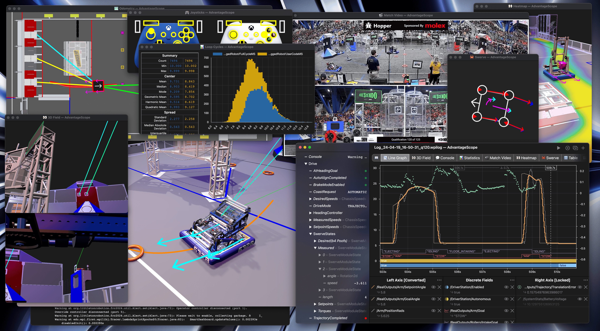
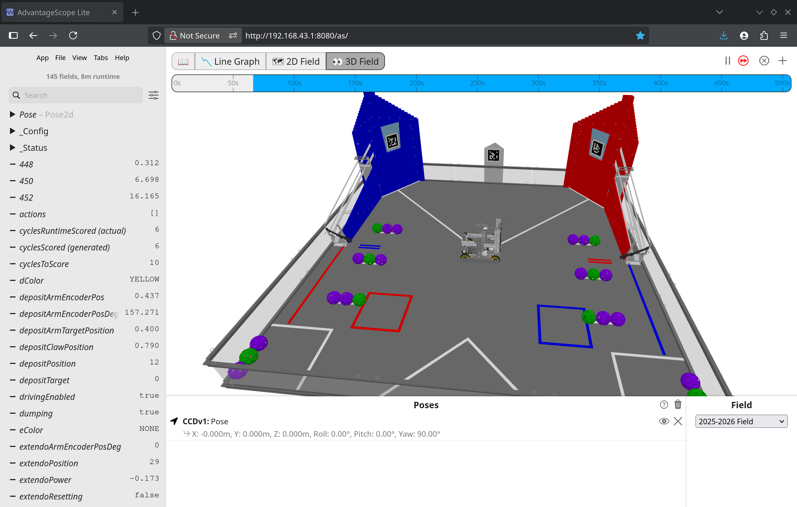

# AdvantageScope Lite for FTC

AdvantageScope is a robot diagnostics, log review/analysis,
and data visualization application for FIRST teams developed by Team 6328.
It reads logs in WPILOG, DS log, Hoot (CTRE), Road Runner, CSV, and RLOG file formats,
plus live robot data viewing using NT4, Phoenix, RLOG, or FTC Dashboard streaming.

AdvantageScope includes the following tools:

- A wide selection of flexible graphs and charts
- 2D and 3D field visualizations of pose data, with customizable CAD-based robots
- Synchronized video playback from a separately loaded match video
- Joystick visualization, showing driver actions on customizable controller representations
- Swerve drive module vector displays
- Console message review
- Log statistics analysis
- Flexible export options, with support for CSV and WPILOG

AdvantageScope Lite for FTC allows you to install AdvantageScope directly on your FTC robot,
for convenient live viewing and log replay.
It has plug and play support for any library that uses FTC Dashboard for live view, such as Road Runner and Pedro Pathing.
For match replays, it has instant support for viewing Road Runner and PsiKit logs, including from before you installed AdvantageScope!

**View the [online documentation](https://docs.advantagescope.org) or find it offline by clicking the 📖 icon in the tab bar.**





## Installation
Add the dairy releases repository to your `TeamCode` `build.gradle`, above the `dependencies` block:
```groovy
repositories {
    maven {
        url = "https://repo.dairy.foundation/releases"
    }
}
```

Then add AdvantageScope to the `dependencies` block:
```groovy
dependencies {
    implementation("page.j5155.AdvantageScope:v26.0.0")
}
```

## Usage

Web UI is available at http://192.168.43.1:8080/as/

**Make sure to download the [AllAssetsDefaultFTC.zip bundle](https://github.com/Mechanical-Advantage/AdvantageScopeAssets/releases/download/bundles-v1/AllAssetsDefaultFTC.zip)
and upload it using the File -> Upload Asset button to use the 2D and 3D field views!**

Check out the [official AdvantageScope docs](https://docs.advantagescope.org/) for more detailed info!

Here's some FTC-specific notes:

It will automatically connect to FTC Dashboard if available;
NetworkTables can also be selected from the preference menu.

Custom assets may be uploaded as zip files through the File → Upload Asset button.
Zip files can contain any folder structure, multiple assets, and even other zip files.
You can download premade assets from https://github.com/Mechanical-Advantage/AdvantageScopeAssets/releases

Logs can be opened using the File -> Open Logs button.
It looks for Roadrunner logs by default but supports all AdvantageScope formats;
the logs folder can be changed in the preferences.

## Developer Instructions

Build by symlinking in the lite output from https://github.com/j5155/AdvantageScope/tree/ftc-lite
